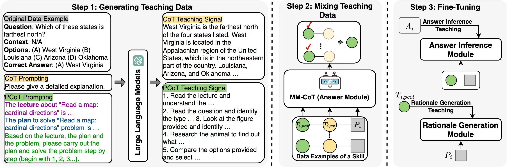
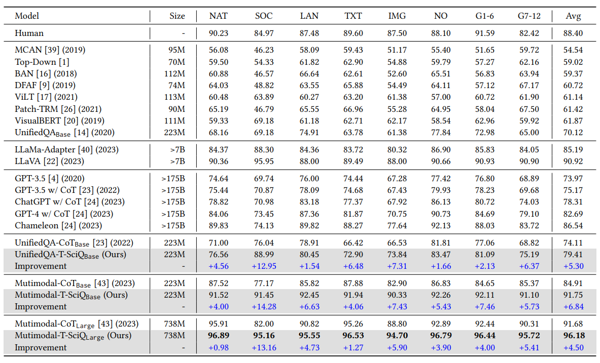
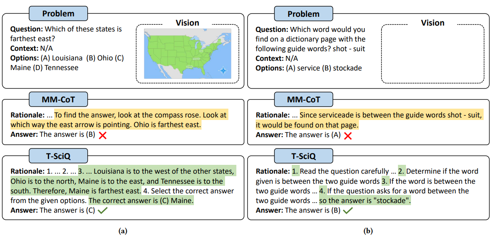

# T-SciQ: Teaching Multimodal Chain-of-Thought Reasoning via Large Language Model Signals for Science Question Answering

## Method



Key steps of our T-SciQ approach. T-SciQ consists of three stages: (i) generating teaching data; (ii) mixing teaching data by policy; and (iii) fine-tuning.

## Results



Extensive experimental results show that our T-SciQ method achieves a new state-of-the-art performance on the ScienceQA benchmark, with an accuracy of 96.18\%. Moreover, our approach outperforms the most powerful fine-tuned baseline by 4.5\%.

## How to Use

### Install

```
git clone https://github.com/amazon-science/mm-cot
cd mm-cot
pip install -r requirements.txt
```

### Datasets

Download the dataset from the following repository:

```
https://github.com/lupantech/ScienceQA/tree/main/data
```

Download the extracted vision features from [vision_features](https://drive.google.com/file/d/13B0hc_F_45-UlqPLKSgRz-ALtFQ8kIJr/view?usp=share_link) and unzip the files under `vision_features`

### Training

```
# rationale generation
CUDA_VISIBLE_DEVICES=0,1 python main.py \
    --model allenai/unifiedqa-t5-base \
    --user_msg rationale --img_type detr \
    --bs 8 --eval_bs 4 --eval_acc 10 --output_len 512 \
    --final_eval --prompt_format QCM-LE

# answer inference
CUDA_VISIBLE_DEVICES=0,1 python main.py \
    --model allenai/unifiedqa-t5-base \
    --user_msg answer --img_type detr \
    --bs 8 --eval_bs 4 --eval_acc 10 --output_len 64 \
    --final_eval --prompt_format QCMG-A \
    --eval_le experiments/rationale_allenai-unifiedqa-t5-base_detr_QCM-LE_lr5e-05_bs16_op512_ep20/predictions_ans_eval.json \
    --test_le experiments/rationale_allenai-unifiedqa-t5-base_detr_QCM-LE_lr5e-05_bs16_op512_ep20/predictions_ans_test.json
```

### Inference

```
# rationale generation
CUDA_VISIBLE_DEVICES=0,1 python main.py \
    --model allenai/unifiedqa-t5-base \
    --user_msg rationale --img_type detr \
    --bs 8 --eval_bs 4 --eval_acc 10 --output_len 512 \
    --final_eval --prompt_format QCM-LE \
    --evaluate_dir models/MM-CoT-UnifiedQA-base-Rationale

# answer inference
CUDA_VISIBLE_DEVICES=0,1 python main.py \
    --model allenai/unifiedqa-t5-base \
    --user_msg answer --img_type detr \
    --bs 8 --eval_bs 4 --eval_acc 10 --output_len 64 \
    --final_eval --prompt_format QCMG-A \
    --eval_le models/rationale/predictions_ans_eval.json \
    --test_le models/rationale/predictions_ans_test.json \
    --evaluate_dir models/MM-CoT-UnifiedQA-base-Answer
```

### T-SciQ Dataset Generation

Step1 Generate QA-CoT dataset

```
python generate_cot.py
```

Step2 Generate lectures and plans

```
python generate_lectures.py
python generate_plans.py
```

Step3 Generate QA-PCoT dataset

```
python generate_pcot.py
```

Step4 Mix QA-CoT dataset and QA-PCoT dataset based on the policy inference results


### Case Study



Examples of MM-CoT (baseline) and the model trained with T-SciQ (ours) signals for generating rationales and predicting answers. To solve these examples, commonsense knowledge such as geographic knowledge (a) and multi-step reasoning (b) are required.

